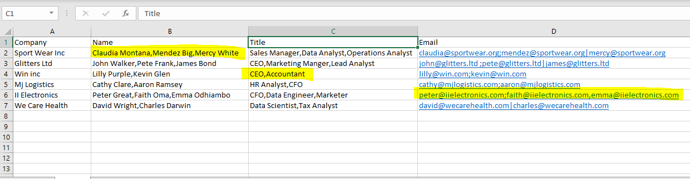

```{r setup, include=FALSE}
knitr::opts_chunk$set(echo = TRUE, warning = FALSE, message = FALSE)
```
It's common to receive contact data formatted as in the screenshot below whereby 2 or more names, titles, and emails are in one cell.. Each client may have multiple emails. To load this data into your database's contact table, you must separate each contact into its own record.



## Steps to follow
* Load the required libraries.
* Import the contacts dataset to clean.

A quick preview of the file shows that names are separated by a comma, ditto titles. Emails are separated by either a comma, pipe or semi colon. 

* To get all the delimiters without missing any, use gsub with regex.
* Call the separate_rows function from tidyr. 
* We will then pass in our data, columns to separate, and delimiters into this function. Good news, you can pass multiple delimiters into sep and that is what will we do.
* Lastly,separate Name into First_Name and Last_Name.

**NB: The separate_rows function has been superseded by separate_longer_delim.**

## Loading Required Libraries
```{r, echo=FALSE}
libs <- c('tidyverse','readxl','here','gt')
invisible(lapply(libs, library, character.only = T))
```

```{r, echo=FALSE, message=FALSE}
here::here()
```


## Import Contacts Dataset
```{r}
contacts_to_clean <- read_excel("emails_to_clean.xlsx")

```

\newpage
## Extract all Unique Delimiters
### Create function to extract delimiters, exclude letters,numbers,space,., and @.
```{r}

extract_delimiters <- function(text) {
  return(gsub("[[:alnum:]@. ]+", "", text))
}

```
### Apply the function to our data to extract all delimiters
```{r}
# Extracting all delimiters
email_delimiters <- c(
  unlist(lapply(contacts_to_clean$Name, extract_delimiters)),
   unlist(lapply(contacts_to_clean$Title, extract_delimiters)),
   unlist(lapply(contacts_to_clean$Email, extract_delimiters))
  ) %>% 
   str_trim() %>%  str_c(collapse = "")
```

### Get unique delimiters
```{r}
# Extracting the unique delimiters
unique_delimiters <- unlist(strsplit(email_delimiters, "")) %>%  str_unique()
unique_delimiters
```


## Separate each Contacts into it's own record
Pass the unique delimiters to sep as in the code below.
```{r}
cleaned_contacts <- contacts_to_clean %>% 
  separate_rows(c(Name, Title, Email), sep ='[,+;+|]')

cleaned_contacts %>% gt()
```
\newpage
## Separate name into first and last name
```{r}
cleaned_contacts %>% 
  separate(Name, c('First_Name', 'Last_Name'), sep = ' ') %>% 
  gt()
```


